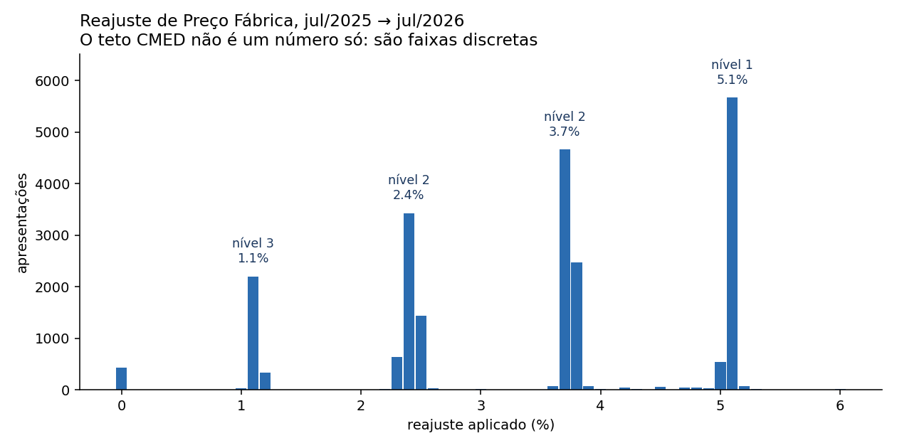
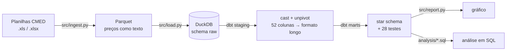
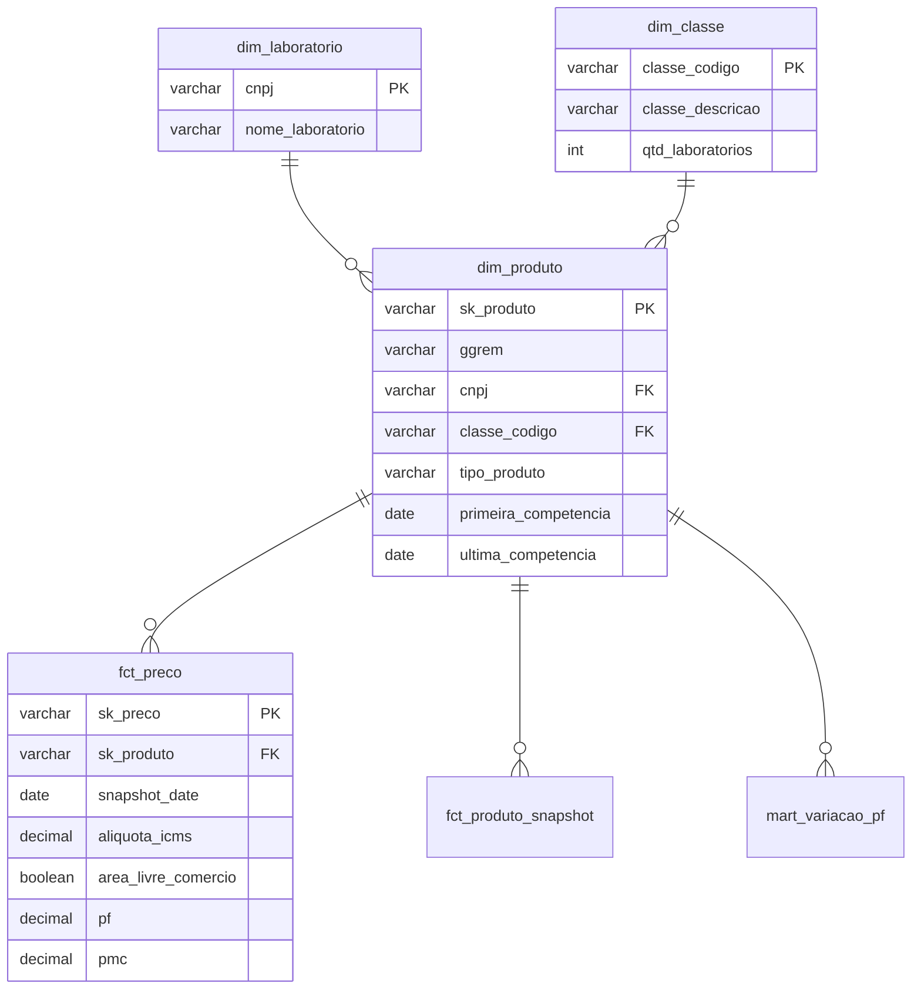

# Pipeline CMED — preços regulados de medicamentos

[](https://github.com/IgorBusnardo/CMED_Pipeline_precos/actions/workflows/pipeline.yml)
[](https://github.com/IgorBusnardo/CMED_Pipeline_precos/actions/workflows/fonte.yml)

Pipeline de dados sobre a **Lista de Preços de Medicamentos da CMED/Anvisa**: extrai as planilhas publicadas, modela em star schema no DuckDB, valida com testes dbt e responde uma pergunta que o dado bruto não responde — **quanto cada medicamento pôde subir de preço, e o que explica a diferença**.



---

## O achado

A leitura comum do setor é que o reajuste da CMED é um teto único e que todo laboratório aplica esse teto. **Os dados não sustentam isso.**

Comparando as competências de jul/2025 e jul/2026 (23.202 apresentações presentes nas duas, ICMS 18%; 98 reajustes marcados como outlier ficam de fora):

| | |
|---|---|
| Apresentações no teto (~5,1%) | **26,3%** |
| Reajuste mediano | **3,71%** |
| 1º quartil | **2,36%** |

O reajuste não se distribui — ele se **concentra em quatro faixas discretas** (1,1% / 2,4% / 3,7% / 5,1%). E a faixa varia de forma contraintuitiva por tipo de produto:

| Tipo de produto | Reajuste mediano | % no teto |
|---|---:|---:|
| Genérico | 3,77% | 35,3% |
| Similar | 3,72% | 30,0% |
| Novo | 2,48% | 18,8% |
| Biológico | 2,36% | 2,0% |

Genérico barato reajusta **mais** que biológico caro. A CMED classifica por concentração de mercado da classe terapêutica, não por preço do produto.

> **Hipótese, não conclusão:** as quatro faixas são compatíveis com os níveis 1/2/3 da regra CMED, mas são quatro grupos para três níveis. O mapeamento exato exige cruzar com o texto da resolução do ano — não está validado aqui.

### Um caminho analítico que não deu em nada (e por que está no repo)

Testei antes a hipótese de analisar **margem de varejo** pela diferença entre PF (Preço Fábrica) e PMC (Preço Máximo ao Consumidor). Não há sinal: o fator PMC/PF é uma constante regulada.

| Lista PIS/COFINS | fator PMC/PF | mín | máx |
|---|---:|---:|---:|
| Positiva | 1,3821 | 1,3766 | 1,3846 |
| Negativa | 1,3415 | 1,3401 | 1,3434 |
| Neutra | 1,3510 | 1,3509 | 1,3511 |

Não varia por classe terapêutica, laboratório ou tipo de produto — e nem por estado: o fator é idêntico nas 13 faixas de ICMS, porque PF e PMC escalam juntos. Em percentual, a margem máxima é a mesma no país inteiro.

A query está em [`analysis/02_margem_e_constante.sql`](analysis/02_margem_e_constante.sql) porque descartar uma hipótese com evidência faz parte do trabalho.

---

## Arquitetura



O cast de preço acontece **no dbt, não na extração**. O Parquet é cópia fiel da planilha, auditável contra a origem; uma regra de limpeza errada se corrige com `dbt build`, sem reprocessar a ingestão.

## Modelo dimensional



**Grão de `fct_preco`:** apresentação × competência × faixa de ICMS × ALC. 1.293.700 linhas.

## Decisões de engenharia

Cada uma resolve um problema real desta base:

| Problema na origem | Decisão |
|---|---|
| Cabeçalho na linha 41, precedido de notas que mudam de tamanho a cada competência | Detecção do cabeçalho por âncora (`SUBSTÂNCIA`), não por número fixo |
| A coluna `COMERCIALIZAÇÃO 2024` virou `COMERCIALIZAÇÃO 2025` — schema drift a cada ano | O ano sai do **nome** da coluna e vira **dado** (`ano_comercializacao`) |
| 1.120 preços trazem asterisco de nota de rodapé colado no número (`"230857,28*"`) | Macro `brl_to_decimal`. Sem ela o cast retorna `null` em silêncio e o produto some da análise |
| Coluna vazia numa competência muda de tipo no Parquet e quebra a união | Contrato explícito: tudo que vem da planilha é `string` |
| **GGREM não é único.** O código `541821110172303` aparece em dois medicamentos diferentes (naratriptana e doxazosina) na competência de 2025 | Chave composta `GGREM + registro ANVISA`. O teste `unique` do dbt foi o que expôs isso |
| EAN também não serve como chave (356 grupos duplicados) | Documentado, não usado como chave |
| Reajustes de +9.899% e −89%, quase sempre rerregistro reusando o GGREM | **Marcados** com `flag_outlier`, não deletados. A decisão de excluir fica com quem consome, não escondida no pipeline |
| 52 colunas de preço (PF/PMC × 26 faixas) — formato inanalisável em SQL | Unpivot para formato longo; a faixa de ICMS sai do nome da coluna e vira dado |
| A Anvisa publica só a competência vigente, com timestamp no nome do arquivo | O link é resolvido da página em tempo de execução, não fixado no código |
| CI que baixa de site do governo quebra quando o órgão republica | Dois workflows: `pipeline` roda sobre fixtures versionadas, `fonte` checa a disponibilidade real semanalmente |
| A CMED publicou `.xls` até certa competência e `.xlsx` depois | Fonte identificada por nome-base; a extensão é resolvida em disco |
| Fixar a competência no config faria cada arquivo novo exigir edição de código | A data vem da linha `Publicada em` dentro da planilha — a fonte se descreve |

### Por que DuckDB e não Spark

26 mil linhas por competência, duas competências por ano. Spark aqui seria custo de operação sem ganho de processamento. DuckDB dá SQL completo, roda no CI sem infraestrutura e permite clonar o repo e reproduzir tudo com um comando. Se o volume crescer uma ordem de grandeza, a camada de transformação já é SQL e migra sem reescrita.

Pelo mesmo motivo não há Airflow: são três passos sequenciais. O agendamento é do GitHub Actions.

## Testes e CI

Dois workflows, com responsabilidades separadas:

- **`pipeline`** — roda o pipeline inteiro sobre fixtures versionadas em `tests/fixtures/` (800 linhas por competência, geradas por [`tests/make_fixtures.py`](tests/make_fixtures.py)). Determinístico: valida a lógica, não a disponibilidade de um site externo. A amostra preserva os casos difíceis — preços com asterisco e o GGREM duplicado.
- **`fonte`** — semanal. Baixa a competência vigente da Anvisa e confirma que ainda é parseável. Falha aqui significa que o órgão mudou o site, não que o código quebrou.

`dbt build` roda 28 testes. Os que importam:

- `fct_preco`: unicidade da combinação `sk_produto + snapshot_date + aliquota_icms + area_livre_comercio`
- `fct_preco.pf`: `not_null` e faixa `> 0`
- `fct_preco.fator_pmc_pf`: faixa aceita `[1,30 ; 1,40]` — se sair disso, ou a regra mudou ou o parsing quebrou
- `dim_produto.tipo_produto`: `accepted_values` contra a lista da CMED
- Integridade referencial entre os fatos e `dim_produto` / `dim_laboratorio`

## Como rodar

```bash
pip install -r requirements.txt
```

As planilhas não são versionadas (43 MB). `python src/download.py` resolve e baixa a **competência vigente** direto da [página da Anvisa](https://www.gov.br/anvisa/pt-br/assuntos/medicamentos/cmed/precos) — não há URL fixa por competência, o nome do arquivo carrega um timestamp que muda a cada publicação. Competências anteriores não são servidas pela página e precisam ser colocadas em `data/raw/` manualmente.

A data de cada competência **não fica no código**: é lida da linha `Publicada em DD/MM/AAAA` dentro da própria planilha. Arquivo novo em `data/raw/` entra no pipeline sem editar nada.

```bash
python run.py
```

Extrai, carrega, transforma, testa e gera o gráfico. Depois:

```bash
duckdb data/cmed.duckdb < analysis/01_reajuste_por_nivel.sql
```

## Limitações

Declarar onde o número não vale é parte do resultado.

- **PF e PMC são tetos regulados, não preço praticado.** A base não contém desconto de distribuidora, bonificação, verba de trade nem preço de PDV. Nenhuma conclusão aqui descreve o preço que o consumidor paga.
- **Duas competências anuais são uma comparação, não uma série temporal.** Não há base para falar em tendência.
- O mapeamento das quatro faixas de reajuste para os níveis CMED é hipótese não validada contra a resolução.
- `mart_variacao_pf` usa a faixa de ICMS 18% como referência. Como o fator é constante entre faixas, a escolha não muda a conclusão — muda apenas os valores absolutos.

## Próximos passos

- Calcular HHI por classe terapêutica e testar se a concentração explica a faixa de reajuste
- Adicionar competências anteriores para transformar a comparação em série
- Churn de portfólio: 2.844 apresentações saíram e 2.500 entraram entre as duas competências

## Estrutura

```
src/          extract, load, download e geração do gráfico
transform/    projeto dbt — staging, marts, macros, testes
analysis/     queries de análise sobre as marts
tests/        fixtures de CI e o canário da fonte externa
data/         raw (planilhas), parquet e o arquivo DuckDB — não versionados
run.py        orquestrador
```

## Licença

MIT — ver [LICENSE](LICENSE). Os dados de origem são públicos, publicados pela CMED/Anvisa.
